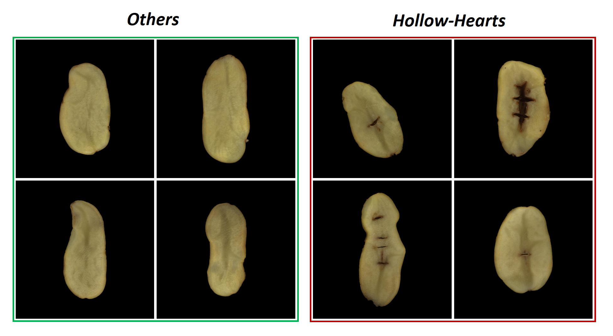
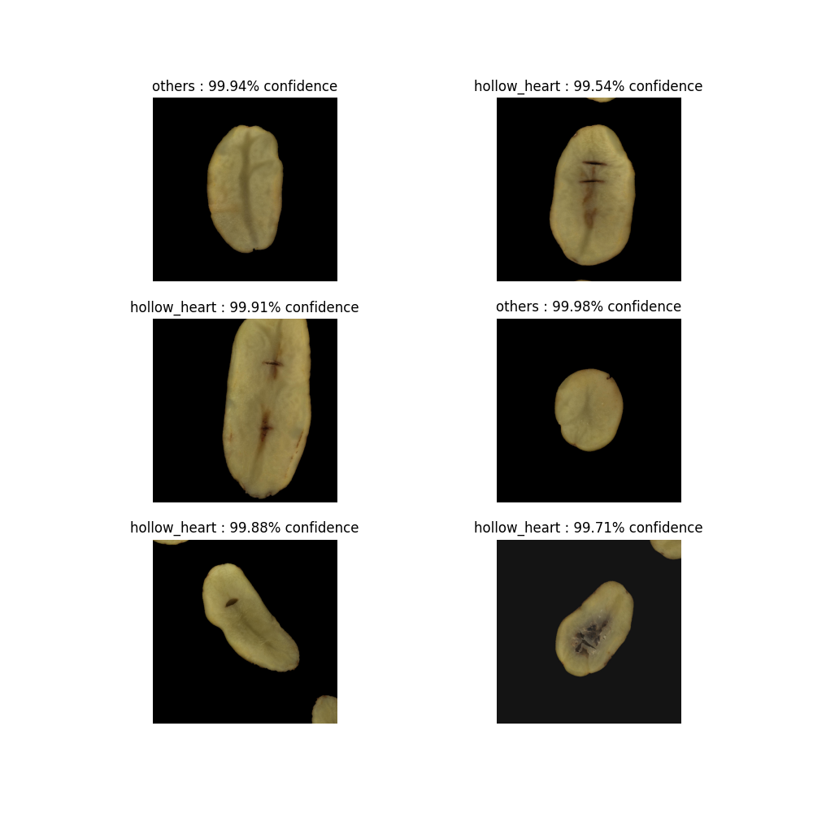
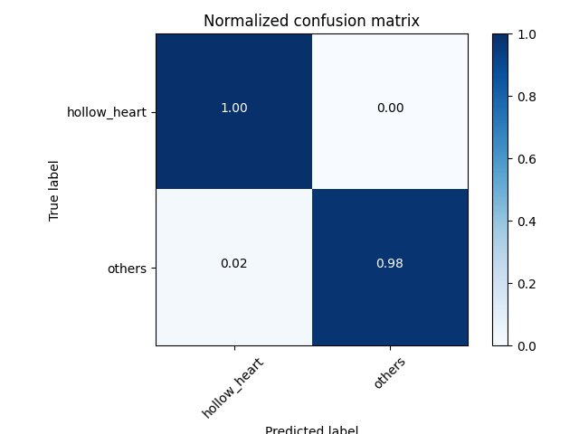

# Potato defect detection using DL #
This is a project to detect potato defects (specifically hollow-heart defects) using deep learning. The project uses a dataset of about 1500 images of potatoes(both healthy and with defects) to train a deep learning classification model. The model is then used to detect defects in new images of potatoes.

## Dataset ##
The dataset used for training the model is in the folder `"Data\tubers.zip"`. The dataset contains 1500 images of potatoes, each of which is labelled as either healthy or with a defect (see `"Data\A08241_internals.csv"`). The images are all of the same size (1900 x 1900 pixels) and are in the RGB format.

Images from Data Set

## Training & Testing the model ##
To train the model, follow the steps below:
1. Intall the required packages by running `"pip install -r requirements.txt"` in the command line. The python version used for this project was 3.9.13.
2. Unzip the dataset in the folder `"Data\tubers.zip"`.
3. Train the classification models by running `"train_models.py "`. The models will be saved in the folder `"Models"`.  In summary, the script does the following:

    - Imports several Python libraries such as matplotlib, tensorflow, numpy, etc., and several custom functions from `'functions.py'` and `'preprocess_.py'`.
    
    - Sets up some parameters such as the data directory, saving directory, number of runs, batch size, image height, image width, filter size, number of epochs, and the choice of the deep learning model to use.

    - Preprocesses the data by loading the dataset of potato images, splitting it into training and testing sets, and resizing, and visualizes some of the images.

    - Creates a deep learning model based on the specified choice of the deep learning model

    - Trains the model using the training and validation data sets, tests the model using the testing data set, and saves the model.
    
    - Repeat last 2 steps for a specified number of runs.

4. To test the model, run `"test_model.py"` or `"test_model.ipynb"`.

## Sample Results ##
The following are some sample results of the model on the testing data set:

Model Predictions

Confusion Matrix

